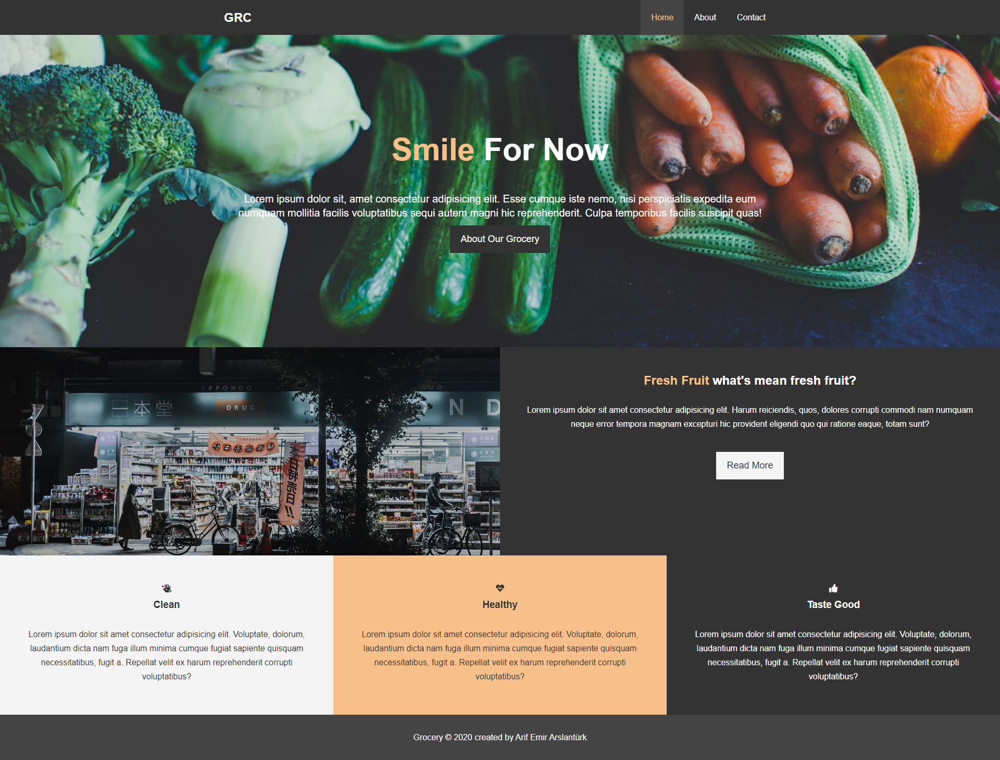
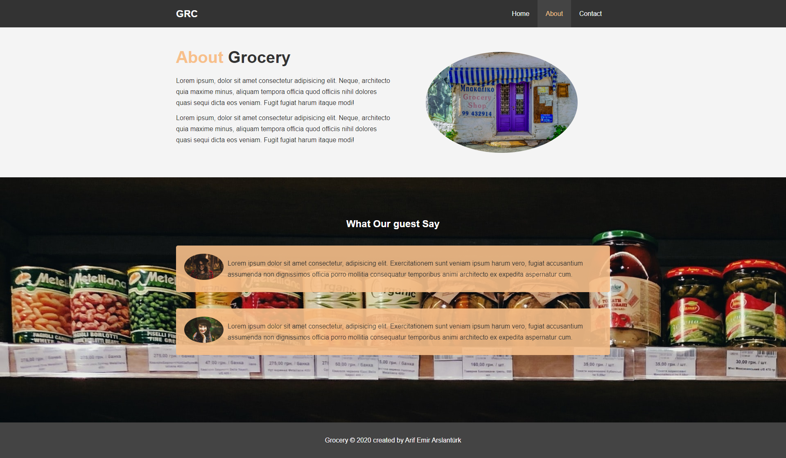
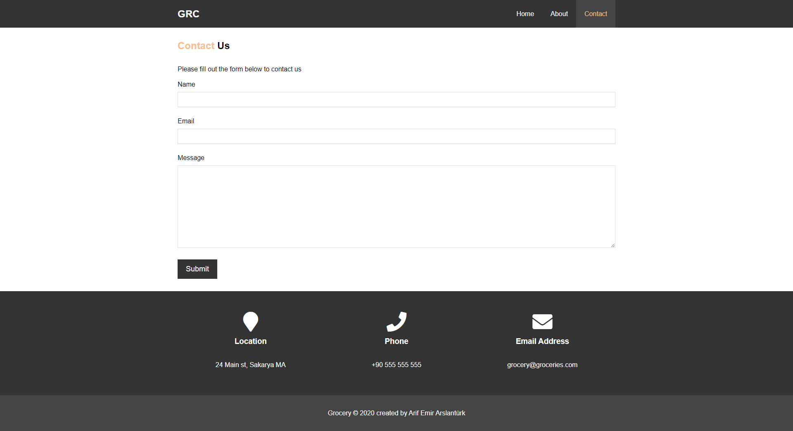
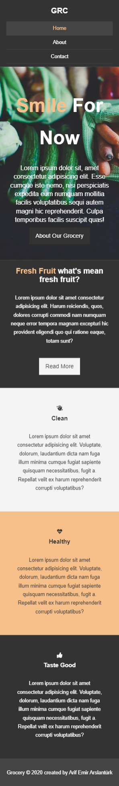
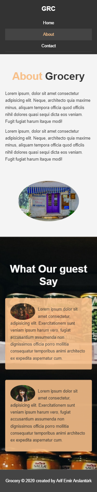
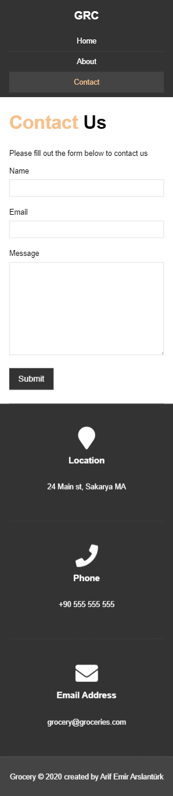

<h1>Grocery App</h1>

this project for a  <b>beginners</b> its  include responsive design ,not using new css features but its good example for beginner

<h2>Layout</h2>

floats used for layout

<h1>Desktop</h1>
<h2>Welcome Page</h2>

<h2>About Page</h2>

<h2>Contact Page</h2>

<h1>Mobile</h1>
<h2>Welcome Page</h2>

<h2>About Page</h2>

<h2>Contact Page</h2>

